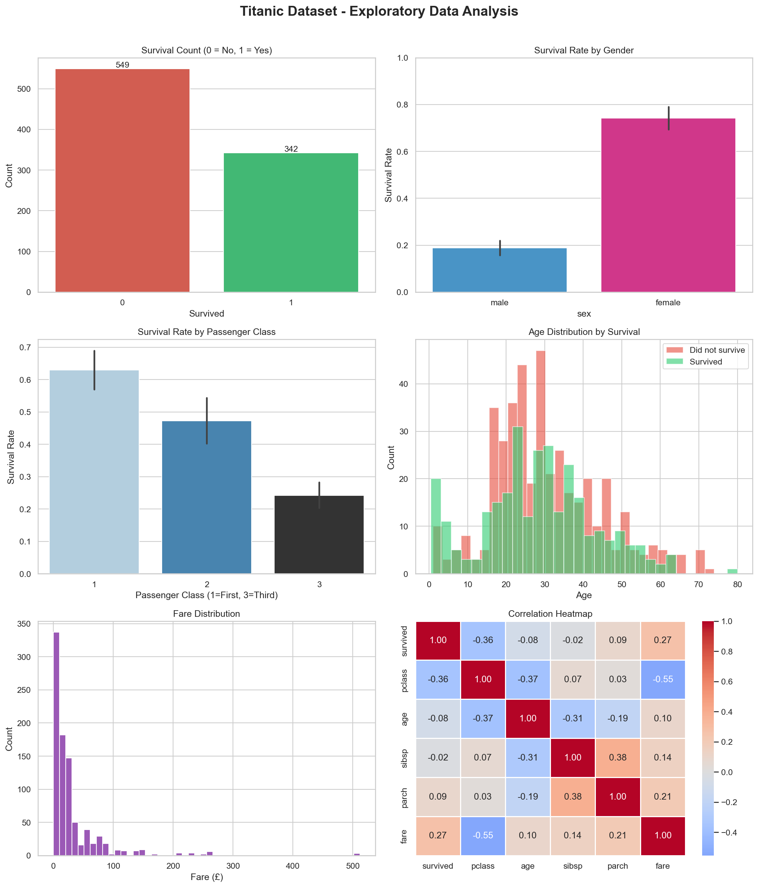

# CodeAlpha_Titanic_EDA
# 🚢 Titanic Dataset – Exploratory Data Analysis (EDA)

### CodeAlpha Data Analytics Internship – Task 2

This project demonstrates the application of **Exploratory Data Analysis (EDA), Statistical Analysis, and Data Visualization** using Python. The analysis focuses on the Titanic dataset to identify patterns, trends, and factors that influenced passenger survival.


## 📌 Project Overview

The objective of this project is to perform a comprehensive exploratory analysis of the Titanic dataset and extract meaningful insights from passenger information.

Through data exploration, statistical summaries, and visualizations, the project investigates how factors such as gender, passenger class, age, and fare affected survival outcomes during the Titanic disaster.


## 🎯 Project Objectives

* Understand the structure and characteristics of the dataset.
* Identify and analyze missing values.
* Generate descriptive statistical summaries.
* Explore survival trends among passengers.
* Examine the influence of demographic and socioeconomic factors.
* Create meaningful visualizations to support analysis.
* Extract actionable insights from the data.


## 📊 Dataset Information

The dataset contains passenger information from the RMS Titanic.

| Attribute | Description              |
| --------- | ------------------------ |
| Dataset   | Titanic Dataset          |
| Source    | Seaborn Built-in Dataset |
| Records   | 891 Passengers           |
| Features  | 15 Columns               |
| Type      | Classification Dataset   |

### Features Used

| Feature  | Description                       |
| -------- | --------------------------------- |
| survived | Survival Status (0 = No, 1 = Yes) |
| pclass   | Passenger Class                   |
| sex      | Gender                            |
| age      | Passenger Age                     |
| fare     | Ticket Fare                       |
| sibsp    | Number of Siblings/Spouses Aboard |
| parch    | Number of Parents/Children Aboard |
| embarked | Port of Embarkation               |


## 🔍 Research Questions

This analysis seeks to answer the following questions:

1. Does gender influence survival rates?
2. Does passenger class affect survival?
3. Were younger passengers more likely to survive?
4. Is there a relationship between fare and survival?
5. Which variables have the strongest impact on passenger survival?


## 📈 Analysis Performed

The project includes:

* Data Exploration
* Missing Value Analysis
* Descriptive Statistics
* Survival Rate Analysis
* Gender-Based Survival Analysis
* Passenger Class Analysis
* Age Distribution Analysis
* Fare Distribution Analysis
* Correlation Analysis
* Data Visualization


## 📊 Dashboard Visualizations

The generated dashboard (`titanic_eda_dashboard.png`) includes:

| Visualization                    | Purpose                                        |
| -------------------------------- | ---------------------------------------------- |
| Survival Count Plot              | Overall survival distribution                  |
| Survival Rate by Gender          | Comparison of male and female survival rates   |
| Survival Rate by Passenger Class | Effect of passenger class on survival          |
| Age Distribution Histogram       | Age patterns among survivors and non-survivors |
| Fare Distribution Histogram      | Distribution of ticket fares                   |
| Fare Outlier Box Plot            | Identification of fare outliers                |
| Correlation Heatmap              | Relationships among numerical variables        |


## 🔑 Key Findings

### 📊 Survival Analysis

* Approximately **38%** of passengers survived.
* The majority of passengers did not survive the disaster.

### 👩 Gender Impact

* Female passengers had a significantly higher survival rate than male passengers.
* Women were prioritized during evacuation procedures.

### 🎩 Passenger Class Impact

* First-class passengers experienced the highest survival rates.
* Third-class passengers faced the lowest survival rates.

### 👶 Age Analysis

* Younger passengers showed slightly better survival outcomes compared to older passengers.

### 💰 Fare Analysis

* Passengers who paid higher fares generally had better survival rates.
* Fare exhibited a positive relationship with survival probability.

### ❓ Missing Values

* The Age and Cabin columns contained substantial missing data requiring attention in future predictive modeling tasks.


## 🛠 Technologies Used

* Python
* Pandas
* NumPy
* Matplotlib
* Seaborn


## ⚙️ Installation

### Install Required Libraries

```bash
pip install pandas numpy matplotlib seaborn
```


## ▶️ How to Run

Execute the script:

```bash
python Titanic_EDA_Analysis.py
```

The script will automatically:

1. Load the Titanic dataset.
2. Perform exploratory data analysis.
3. Generate statistical summaries.
4. Create visualizations.
5. Save the dashboard as `titanic_eda_dashboard.png`.
6. Display key findings in the console.


## 📁 Project Structure

```text
Titanic_EDA/
│
├── Titanic_EDA_Analysis.py
├── titanic_eda_dashboard.png
└── README.md
```


## 🖼 Output

### EDA Dashboard




## 🚀 Future Enhancements

* Handle missing values through advanced preprocessing techniques.
* Perform feature engineering for improved insights.
* Develop machine learning models to predict passenger survival.
* Create interactive dashboards using Plotly or Streamlit.
* Compare multiple classification algorithms for predictive analysis.


## 👨‍💻 Author

**Sunil Pavan Raja**

Bachelor of Technology (Artificial Intelligence and Data Science)

Prathyusha Engineering College

GitHub: https://github.com/pavansunil75

E-mail id: pavansunil75@gmail.com


## 🙏 Acknowledgements

* CodeAlpha for providing the Data Analytics Internship opportunity.
* Seaborn for providing access to the Titanic dataset.
* The Data Science community for educational resources and best practices.


## 📄 License

This project is intended for educational and internship purposes.

⭐ If you found this project useful, consider giving it a star.
